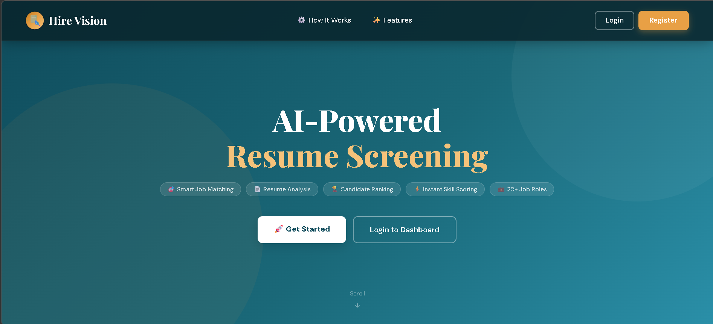
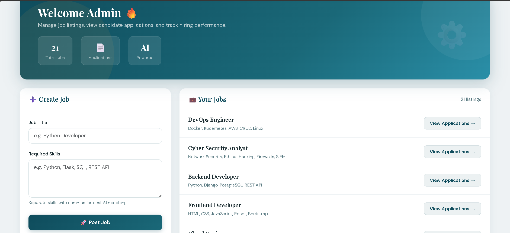
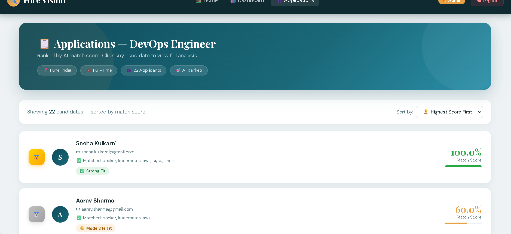
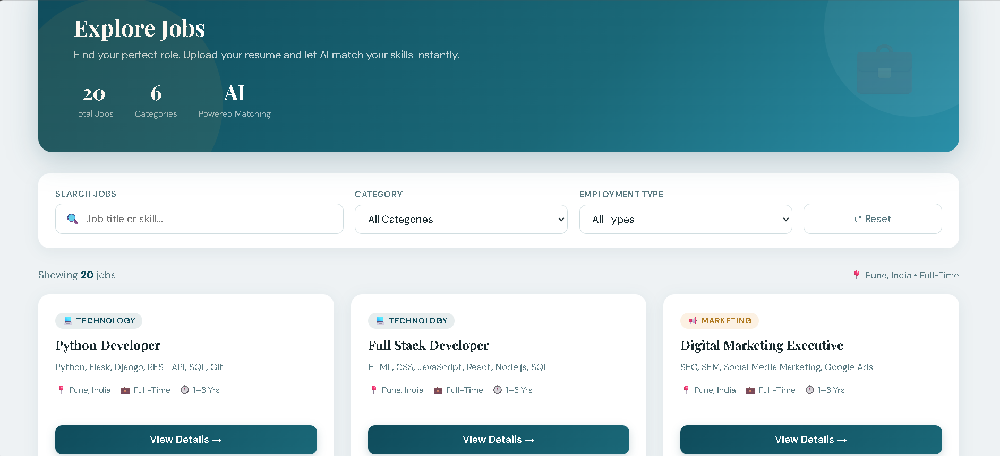
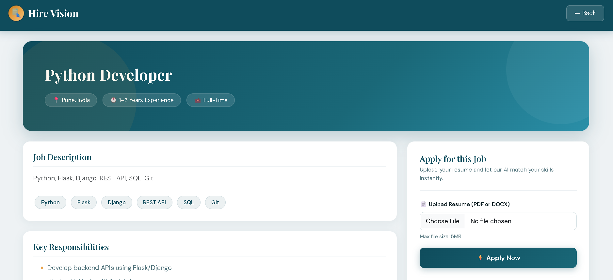
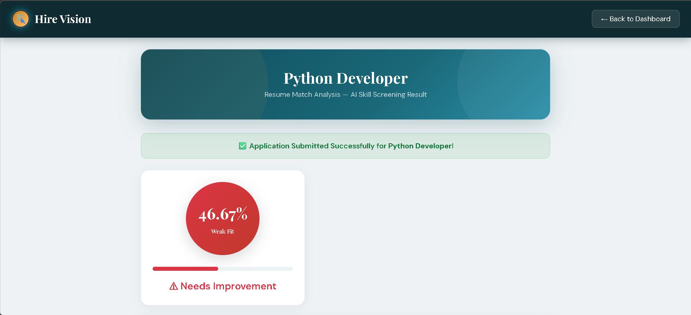

🚀 AI-Powered Resume Screening & Candidate Ranking System

🔍 Intelligent Hiring Using AI, ML & NLP

An AI-driven full-stack web application that automates resume screening, skill gap analysis, and candidate ranking using Machine Learning and Natural Language Processing.   

📌 Problem Statement

Companies receive hundreds of resumes per job opening. Manual screening is:

• Slow (20–40 resumes/hour)

• Inconsistent

• Prone to bias

• Expensive

This system automates the entire screening process using AI.   

💡 Solution

The system:

• Extracts resume text (PDF/DOCX)

• Cleans and processes text using NLP

• Identifies technical skills using spaCy

• Expands skills using semantic taxonomy

• Calculates match score using TF-IDF + Cosine Similarity

• Predicts job category using Logistic Regression (trained on 9,544 resumes)

• Ranks candidates automatically   

🧠 Tech Stack

• Python

• Flask

• PostgreSQL

• NLTK

• spaCy

• Scikit-learn

• pdfminer.six

• SQLAlchemy

• Flask-Login   

⚙️ AI Pipeline

Resume Upload → Text Extraction → NLP Cleaning →
Skill Recognition → Semantic Expansion →
TF-IDF Vectorization → Cosine Similarity →
ML Job Prediction → Ranked Output   

🏆 Key Features
For Candidates

• Instant AI match score

• Matched & Missing Skills

• Career Fit Prediction

• Skill Gap Report   

For HR / Admin

• Auto-ranked candidate dashboard

• Gold, Silver, Bronze ranking

• Download resume from database

• Data-driven hiring decisions   

📊 Scoring Formula

If all skills match → 100%

Otherwise:
Final Score = (Skill Match × 70%) + (TF-IDF Score × 30%)   

📷 Screenshots

  
📈 Business Impact

• Reduces screening time from hours to seconds

• Eliminates bias

• Provides structured candidate feedback

• Improves hiring efficiency   

👩‍💻 Developed By

Vaishnavi Gade
BSc Student | AI & Machine Learning Enthusiast
